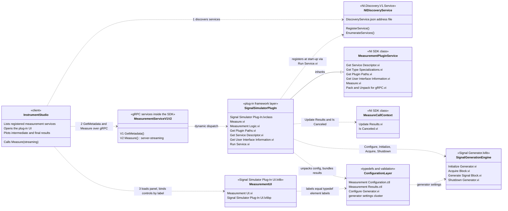
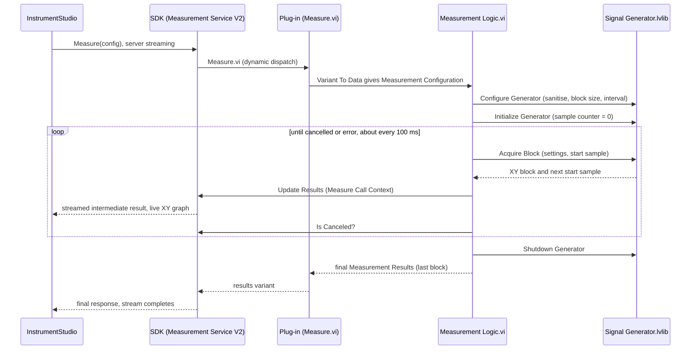

# Signal Simulator architecture

The Signal Simulator is a LabVIEW **Measurement Plug-In SDK** (MeasurementLink) plug-in. It needs no
hardware: it synthesises a sine, square or linear-chirp waveform with additive noise and streams it to
InstrumentStudio (or any MeasurementLink client) as a continuously updating XY graph.

## Project layout

```
Signal Simulator.lvproj                 LabVIEW project (class, two libraries, UI packed-library build spec)
Signal Simulator Plug-In/               Plug-in framework layer (one class, derived from the NI SDK)
  Signal Simulator Plug-In.lvclass        Measurement Plugin Service child class
  Measurement Configuration.ctl           Configuration typedef  (client -> plug-in)
  Measurement Results.ctl                 Results typedef        (plug-in -> client)
  Measurement Logic.vi                    Orchestrates initialize / configure / acquire / shutdown
  Measure.vi, Get Plugin Paths.vi, ...    Framework overrides (see below)
Signal Generator/                       Signal generation engine (no framework dependencies)
  Signal Generator.lvlib
    Configure Generator.vi                Configuration  - sanitise settings, derive block size / interval
    Initialize Generator.vi               Initialization - reset the sample counter
    Acquire Block.vi                      Acquisition    - produce one XY block
    Generate Signal Block.vi              Engine         - sine / square / chirp + noise maths
    Shutdown Generator.vi                 Shutdown       - finalise the run, report total samples
Signal Simulator Plug-In UI/            User interface layer
  Signal Simulator Plug-In UI.lvlib
    Measurement UI.vi                     Front panel shown by InstrumentStudio
BuiltUI/                                (generated, git-ignored) Signal Simulator Plug-In UI.lvlibp
docs/                                   This documentation
```

The engine library knows nothing about gRPC, the SDK or InstrumentStudio, so it can be tested or reused
on its own. The plug-in class is the only place where the SDK is touched.

## Architecture diagram



## Run-time sequence (one measurement)



## Staged components (SDK best-practice layout)

| Stage | VI | Responsibility |
|---|---|---|
| Configuration | `Configure Generator.vi` | Takes the five user settings, makes amplitude and noise non-negative, coerces sample rate to 1 S/s .. 10 MS/s and frequency to 0 .. Nyquist, derives the block size (about 100 ms of data, 16 .. 100 000 samples) and the 100 ms update interval. Returns one `generator settings` cluster. |
| Initialization | `Initialize Generator.vi` | Starts a run: absolute sample counter = 0, so the first block starts at t = 0 with zero phase. The simulator uses no sessions, so nothing is opened. |
| Acquisition | `Acquire Block.vi` calls `Generate Signal Block.vi` | Produces one contiguous XY block starting at the absolute sample index. Because the index (not a per-block phase) is carried, blocks join without a phase glitch. |
| Shutdown | `Shutdown Generator.vi` | Finalises the run and reports the total samples. Single place to release resources if the engine ever acquires any. |
| Orchestration | `Measurement Logic.vi` | Runs the four stages, publishes each block with `Update Results`, polls `Is Canceled`, returns the last block as the final result. |

## Signal definitions

`n` is the absolute sample index, `Fs` the sample rate, `A` the amplitude, `f` the frequency.

| Signal type | Definition |
|---|---|
| Sine | `A * sin(2*pi * frac(f*n/Fs))` |
| Square | `+A` when `frac(f*n/Fs) < 0.5`, otherwise `-A` |
| Chirp | Linear sweep from `f` to `min(10*f, 0.45*Fs)` in 1 s, repeating: `A * sin(2*pi * (f*t + 0.5*k*t^2))` with `t = (n/Fs) mod 1 s` and `k = f_stop - f` |
| Noise | Uniform white noise added to every sample; **Noise Level** is the RMS value (`sqrt(12) * (rand - 0.5) * NoiseLevel`) |

## Configuration and results

| Direction | Element | Type | Notes |
|---|---|---|---|
| Configuration | `Amplitude` | double | peak value |
| Configuration | `Frequency` | double | Hz (chirp: start frequency) |
| Configuration | `Sample Rate` | double | S/s |
| Configuration | `Noise Level` | double | RMS amplitude |
| Configuration | `Signal Type` | enum (uint32) | `Sine`, `Square`, `Chirp` |
| Results | `Waveform` | `ni_protobuf_types_DoubleXYData` (x_data, y_data) | time in seconds vs. value; plotted as an XY graph |
| Results | `Total Samples` | double | samples generated so far |

The labels on the `Measurement UI.vi` controls and indicators must equal these element labels exactly;
that is how the framework binds the panel to the measurement.

## Most important classes, APIs and VIs

| Item | Kind | Why it matters |
|---|---|---|
| `Measurement Plugin Service.lvclass` (NI SDK) | Parent class | Defines the overridable framework methods; the plug-in class derives from it. |
| `Signal Simulator Plug-In.lvclass` | Plug-in class | Holds every framework override and the two typedefs. |
| `Run Service.vi` (plug-in and SDK) | Entry point | Creates the gRPC services, registers with the discovery service and blocks until stopped. |
| `Get Service Descriptor.vi` | Override | Display name, version, description and the unique `service class` string used for discovery. |
| `Get Plugin Paths.vi` | Override | Tells the framework which VI and ctl files are the logic, configuration and results. |
| `Get User Interface Information.vi` | Override | Points at `BuiltUI\Signal Simulator Plug-In UI.lvlibp\Measurement UI.vi`. |
| `Get Type Specializations.vi` | Override | Pin, path and enum specialisations; none needed (the enum is added automatically). |
| `Measure.vi` | Override | Converts the configuration variant to the typedef, calls the logic, returns results as a variant. |
| `Pack for gRPC.vi`, `Unpack for gRPC.vi` | Override | Serialisation helpers for the gRPC messages. |
| `Measure Call Context.lvclass` : `Update Results.vi` | SDK API | Streams an intermediate result to the client; **this is how live data reaches InstrumentStudio**. |
| `Measure Call Context.lvclass` : `Is Canceled.vi` | SDK API | Cancellation polling; ends the acquisition loop when the client presses Stop. |
| `Measurement Logic.vi` | Plug-in VI | Orchestrates the staged components. |
| `Generate Signal Block.vi` | Engine VI | All signal mathematics. |
| `Measurement Configuration.ctl`, `Measurement Results.ctl` | Typedefs | The contract with the client. Members of the plug-in class. |
| `ni_protobuf_types_DoubleXYData.ctl` | Typedef (NI) | Marks the result as XY data so clients render a graph. |

`Signal Measurement Complete.vi` and `Wait Until Cancelled or Complete.vi` are template scaffolding kept in
the class. They are not used: cancellation is polled directly inside the acquisition loop, which is
simpler for a loop that runs until cancelled.
